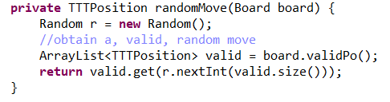

# Tic Tac Toe Game

> This repository hosts the code for the final project. 
> The objective of this project is to construct a comprehensive Tic Tac Toe class that utilizes some of the structures we had studied and was broken out into 3 deliverables

## Usage :sparkles:
1. Run the TTT.jar file 
2. A new window will appear and you can play your game of tic tac toe!
3. First, you will be prompted to select what player to play as: 
   >	Human, RandomAI (Easy), LearningAI (Medium), and PerfectAI (Impossible) are the current available options.
3. If you specified 2 Computer Players, you will be asked how many games you want them to play.
   >	After these games are finished, a game summary will be printed so you know how your players performed.
5. If you select to play as a Human player, you can place your moves by clicking on a place on the gameboard.
6. After the game is over, the window will ask you if you want to play again, hit the 'y' key to continue, otherwise hit 'n'
 
 
 
 
### Deliverable #1:
 > _Create the main structure for the game, and create two players, a human player that plays their moves on the game board by clicking_
 > _and a random player that plays a random move._
Move Logic

Random Player's Move

### Deliverable #2:
 > _Create a third, learning AI player that plays a move based off of the outcomes of the games it plays._
 > _This deliverable requires a HashMap to store these moves & their respective outcomes._
Learned Player's Move

### Deliverable #3:
 > _Create a fourth, perfect AI player that will calculate determine the outcome of all possible moves for the current game state & select the best move._
 > _This algorithim exemplifies the "minimax" algorithm as the optimal move is calculated, the current player will want to maximize their own score, and minimize their opponents._
Perfect Player's Move

## The Code -- 

File Name          |                      Description
-------------------|--------------------------------------------------------------|
TicTacToe.java     | This file is responsible for controlling the flow of the game. Additionally, this file is contains the main executable for the game. To play the game, run this file.
Player.java        | This file defines each possible player that a user can play against.
Board.java         | This file defines the nature of the game board.
